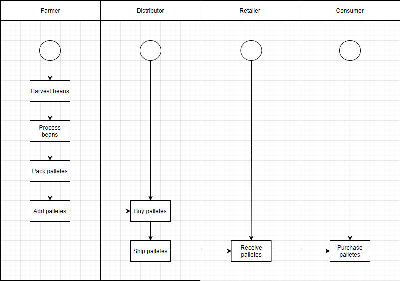
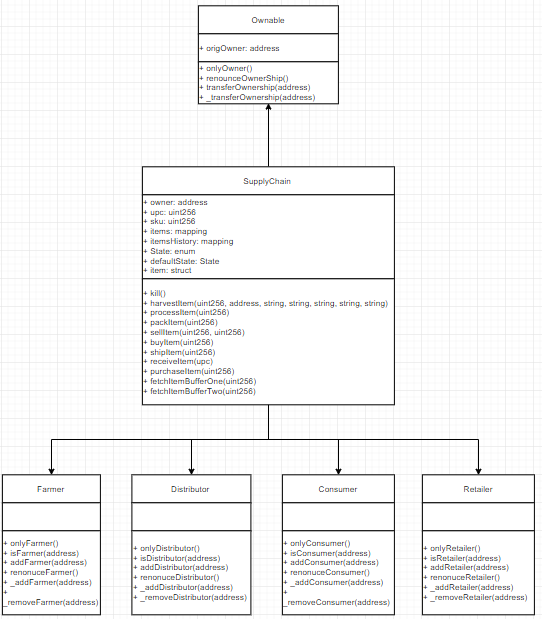
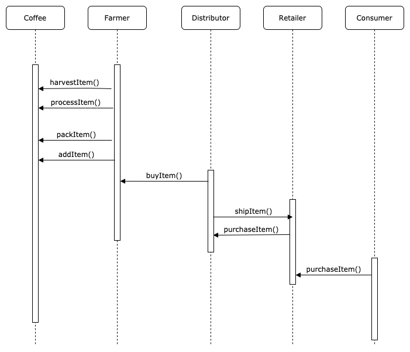
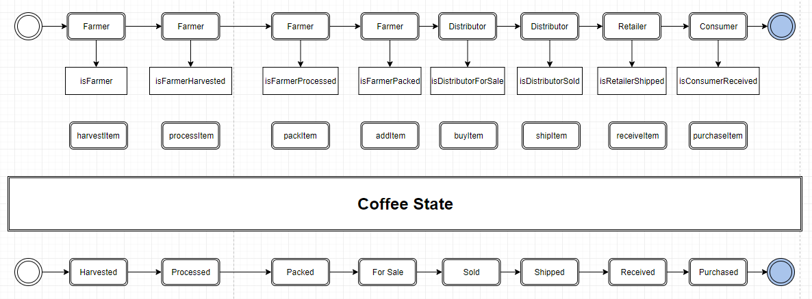

# PROJECT: SUPPLY CHAIN

## Dependencies
```bash
npm 7.9.0
node v12.18.2
Truffle v5.3.1 (core: 5.3.1)
Solidity - 0.8.0 (solc-js)
Node v12.18.2
MetaMask Version 9.4.0
```

## Packages
```bash
@truffle/hdwallet-provider v1.2.6
web3 v1.3.6
```

## Package explanation
* Truffle - is the most popular development framework for Ethereum, it takes care of managing your contract artifacts so you don't have to. Includes support for custom deployments, library linking and complex Ethereum applications.
* @truffle/hdwallet-provider -> needed because previous truffle package is outdated
* Web3 - is a collection of libraries that allow you to interact with a local or remote ethereum node using HTTP, IPC or WebSocket.
* web3 -> is needed for front-end part of application which connects to your Metamask wallet so you can do functionalities on application through Ethereum network

## SupplyChain Addresses
```bash
Contract: 0x95f51797164dD65fAe3d55378695a072D5BC8B48
Transaction Hash: 0x82c2ce82612e492befa18624597ca0df1f3efd783c07cce10534121c8ac9d102
```
* Contract URL: https://rinkeby.etherscan.io/address/0x95f51797164dd65fae3d55378695a072d5bc8b48
* Transaction Hash URL: https://rinkeby.etherscan.io/tx/0x82c2ce82612e492befa18624597ca0df1f3efd783c07cce10534121c8ac9d102

## Run Front-end
* First you need to go inside folder "project-6" by opening your terminal inside project folder and run command 
```bash
cd project-6
```
* Secondly just run this command and application will open in your browser
```bash
npm run dev
```

## Test your app
* Open your terminal inside project folder and fire up truffle 
```bash
truffle develop
```

* Then you should run
```bash
truffle test
```

* "truffle test" command will compile your contracts and run execute all tests which are visible inside project-6/test in "TestSupplyChain.js" file

## Other addresses
* Consumer Role: 0x0969e9e279e4412100e56995302fAa7303c581c4
* Retailer Role: 0xF793C7e8A8F2C1f03FB0988F034d273aE542A4b6
* Distributor Role: 0x9a9FCEDCfB7E6dD1BD93ee01AAc5d324C49Ce1Ca
* Farmer Role: 0xe4147daeB9f7E01DF294CC738230916EbEBadA2c
* Migrations: 0x21050Af727368f21Da3d36AbdA2a35cE0b83d814

### Activity Diagram


### ModelDiagram


### SequenceDiagram


### StateDiagram

